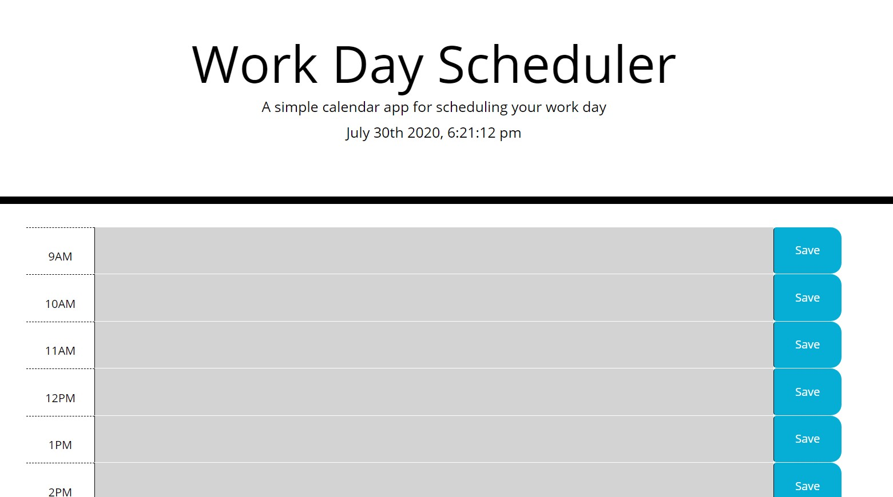
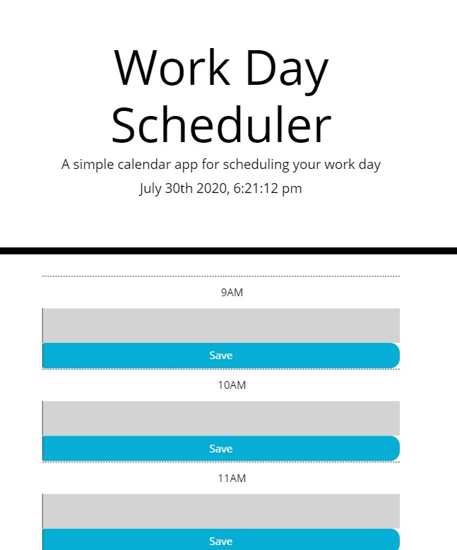
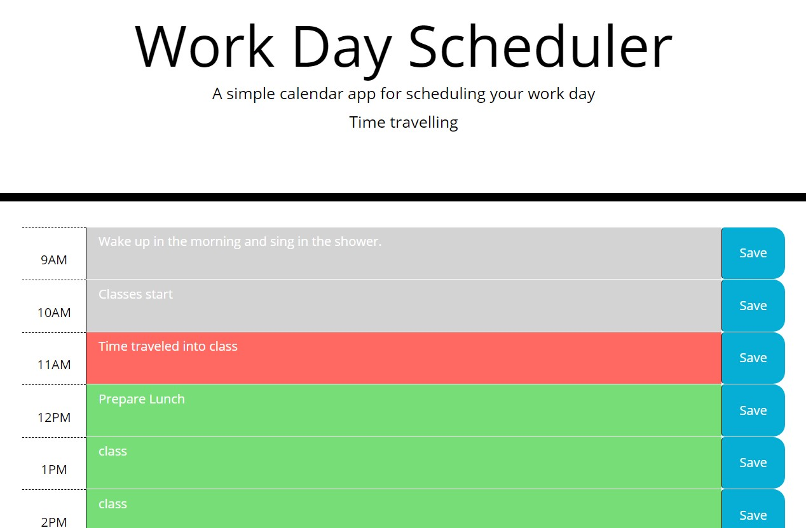

# workDayScheduler
Homework05 - Makoto Asahi

Worked together with a study group - closely with Kenny Yang.


Deployed Link:
https://mrasahi.github.io/workDayScheduler/

# Summary

The given CSS stylesheet already has prewritten styles so I tried my best to preserve them.

Mobile layout had a weird overlap with the buttons.
> Commented out `height` on `.row` in the CSS file to solve this problem.

The current time and day is displayed on the Header part of the page.

9 AM - 5 PM has text boxes for the user to type and submit their plans

Based on the current time, the page will highlight the time blocks.

`Past: Gray`  `Current: Red`  `Future: Green`

The save button will save the user text input into localStorage.

Revisiting the page will render inputs saved within localStorage.
> They will be load title `9` - `17`

This app will only log events based on time.

**Date changes will *NOT* change its contents**

Tested jQuery `.each()` method and had the same results as a vanilla loop.
> Vanilla loop was commented out because we worked hard on that one.

<hr>



### Mobile responsive

<hr>



### Easily see highlighted time blocks

<hr>



## User Story

```
AS AN employee with a busy schedule
I WANT to add important events to a daily planner
SO THAT I can manage my time effectively
```

## Requirements
```
GIVEN I am using a daily planner to create a schedule
WHEN I open the planner
THEN the current day is displayed at the top of the calendar
WHEN I scroll down
THEN I am presented with timeblocks for standard business hours
WHEN I view the timeblocks for that day
THEN each timeblock is color coded to indicate whether it is in the past, present, or future
WHEN I click into a timeblock
THEN I can enter an event
WHEN I click the save button for that timeblock
THEN the text for that event is saved in local storage
WHEN I refresh the page
THEN the saved events persist
```